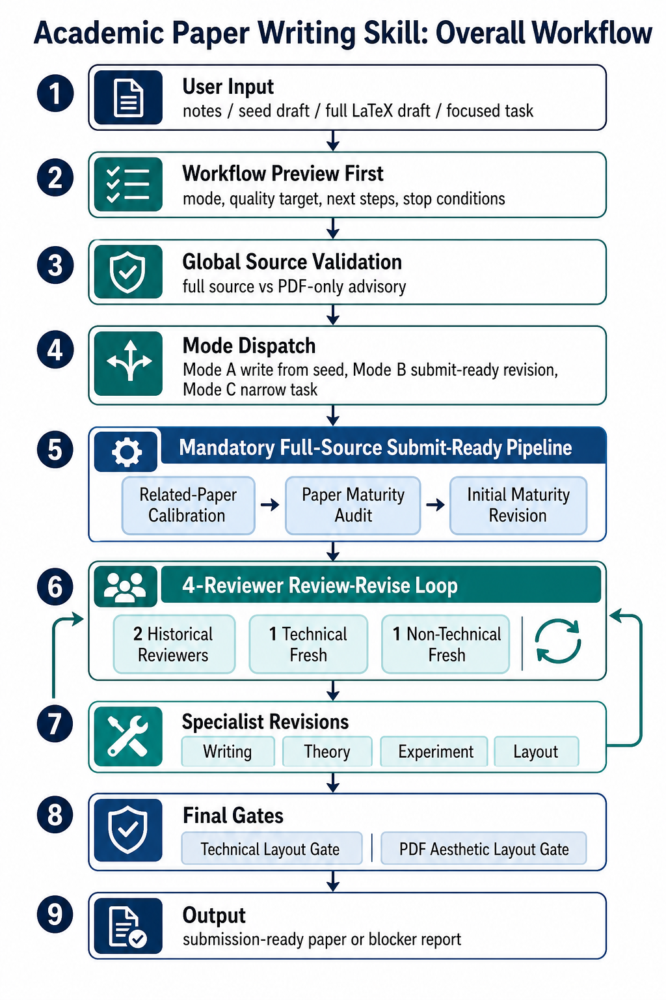
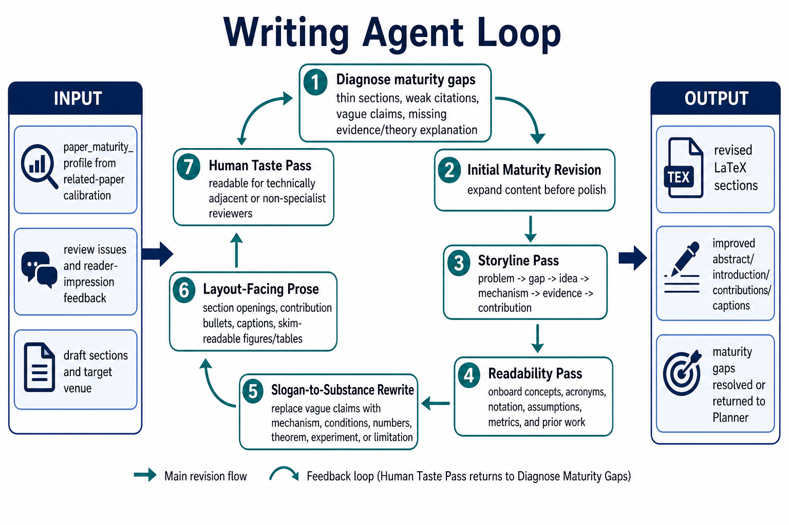
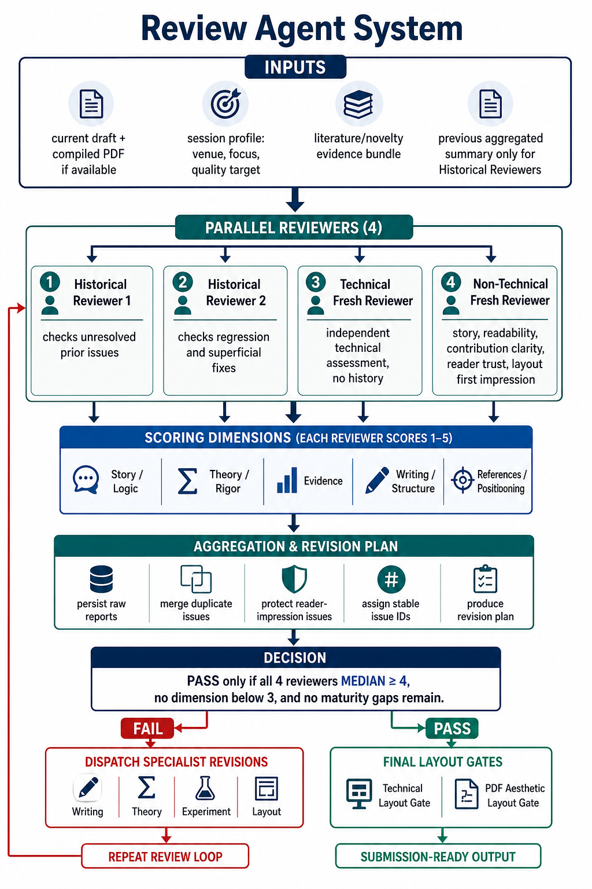

# Academic Paper Writing

This repository contains an `academic-paper-writing` skill for Codex/Claude-style agent workflows focused on STEM paper writing and revision.

The skill is designed for cases such as:

- Writing a paper from scratch from research results or notes
- Revising an existing paper draft
- Strengthening theory, experiments, or writing quality
- Converting a paper to a target venue format
- Running a harsh multi-reviewer review loop before submission

## Repository Structure

```text
.
├── SKILL.md
├── assets/
│   └── readme/
│       ├── overall-workflow.png
│       ├── writing-agent-loop.png
│       └── review-agent-system.png
└── references/
    ├── agent-roles.md
    └── review-criteria.md
```

## What Is Included

### `SKILL.md`

The main skill definition. It describes:

- Entry-point contextual Q&A
- Mode dispatch for writing from scratch, revising a draft, or handling a focused task
- Planner / Theory / Experiment / Writing / Layout agent responsibilities
- A multi-round review-revise loop with historical and fresh reviewers

### `references/agent-roles.md`

Defines the agent architecture and orchestration patterns, including:

- Planner-led coordination
- Parallel theory and experiment work
- Review aggregation
- Layout and final polish cycles

### `references/review-criteria.md`

Defines the review rubric used by review agents, including:

- Scoring dimensions
- Pass conditions
- Section-level writing and layout checks
- Review report template
- Aggregation rules for multi-reviewer feedback

## Typical Workflow

1. Collect context about the paper, venue, focus, and quality target.
2. Choose a mode:
   - write from scratch
   - revise an existing draft
   - handle a specific isolated task
3. Dispatch specialist agents for theory, experiments, writing, and layout as needed.
4. Run parallel review agents to assess the draft.
5. Aggregate issues, revise, and repeat until the quality bar is met.

## Workflow Diagrams

### Overall Workflow



### Writing Agent Loop



### Review Agent System



## Suggested Starting Prompt

```text
Use the academic-paper-writing skill. Target: submit-ready, full-source workflow.

First show the full workflow you will follow, including mode, source validation, calibration,
maturity audit, initial maturity revision, review-revision loop, and final layout gates.
Then execute it in order: related-paper calibration with 2-3 closest mature papers -> paper
maturity audit -> initial maturity revision -> 4-reviewer review-revision loop. Do not stop
after one edit or one review unless there is a real blocker, round limit, or I explicitly stop you.
Keep the paper readable: the story, logic, contribution, technical strength, and evidence chain
should be understandable to a technically adjacent reader.
```

## Use Cases

- NeurIPS / ICML / ICLR style ML papers
- CVPR / ICCV / ECCV style computer vision papers
- IEEE or Springer journal submissions
- Workshop papers or arXiv drafts

## Notes

- This repository currently contains the skill specification and reference documents only.
- It does not include paper source templates, experiment code, or LaTeX build tooling.
- The workflow is intended to be adapted inside an agentic writing environment that can read `SKILL.md` and the reference files.
